# an-arts

`an-arts` 是用来展示`生成式艺术和算法创作`的一个 Kotlin 程序。本程序旨在展示一些有意思的生成式艺术程序。
借助于 `Jetpack Compose For Desktop` 提供的桌面环境，能够更好的探索生成式艺术的魅力。

## 特性

1. 基于 `Jetpack Compose For Desktop` 实现
1. 不断补充的Arts类型
1. 支持图形展示和💫动画展示
1. 方便调节的Arts参数，不同的参数带给你不一样的感受

## 已实现程序

> **说明：**  
> [ 💫 ] 为动画类型Arts

+ CircleLoop
  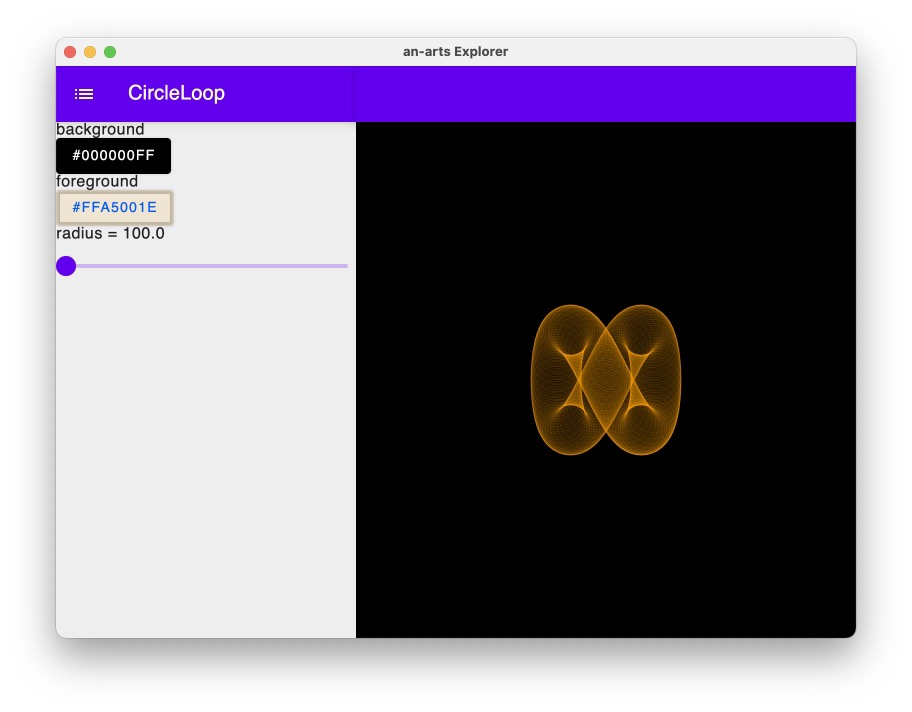
+ Maze
  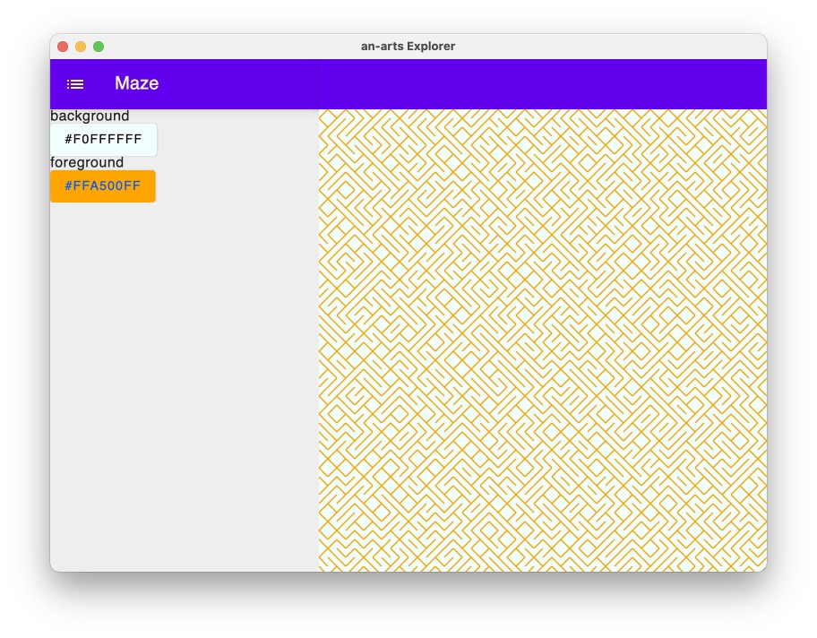
+ 💫 RotatingSquares
  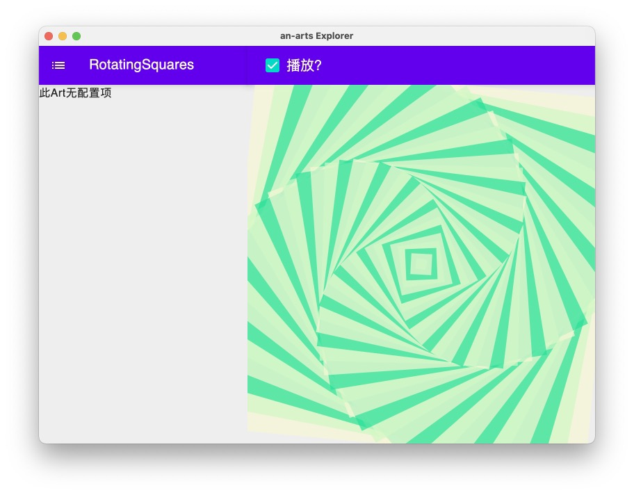
+ 💫 CircleAndDotGrid
  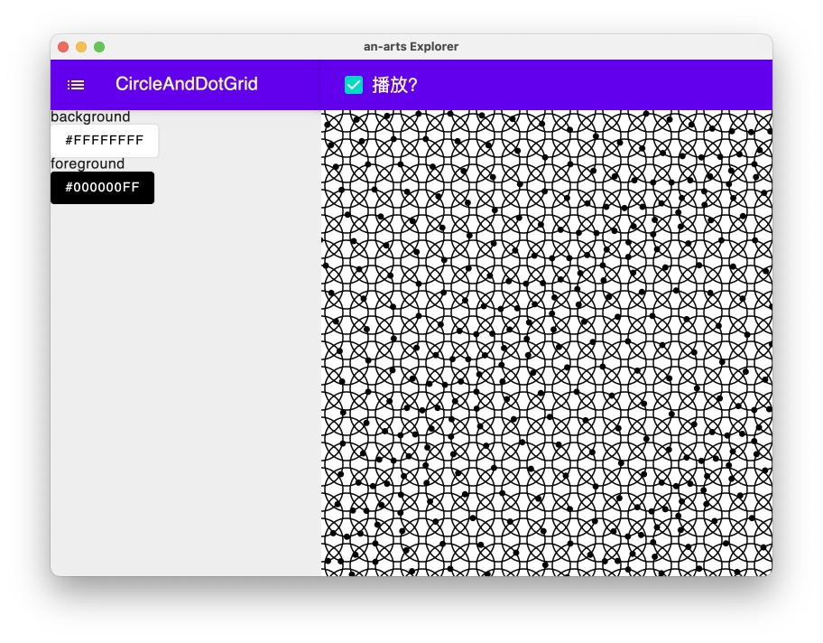
+ 💫 CircleGridScale
  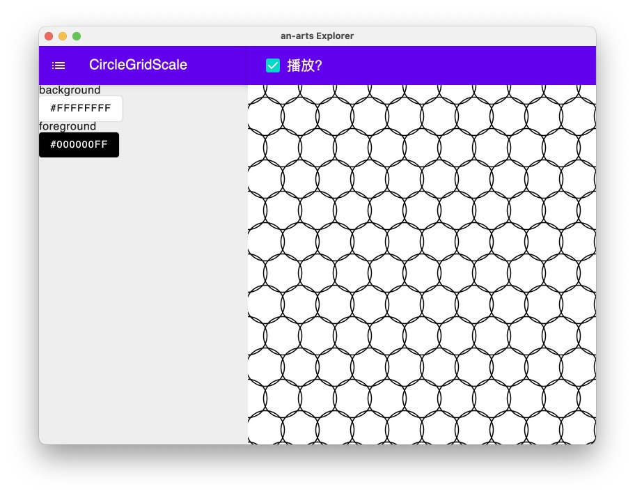
+ Yarn
  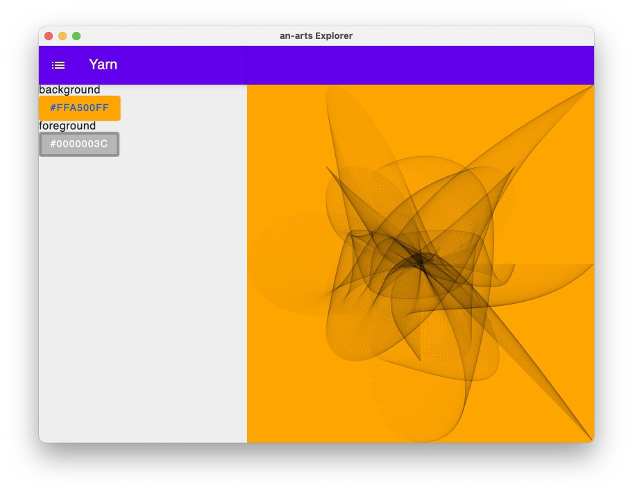
+ 💫 Hearts
  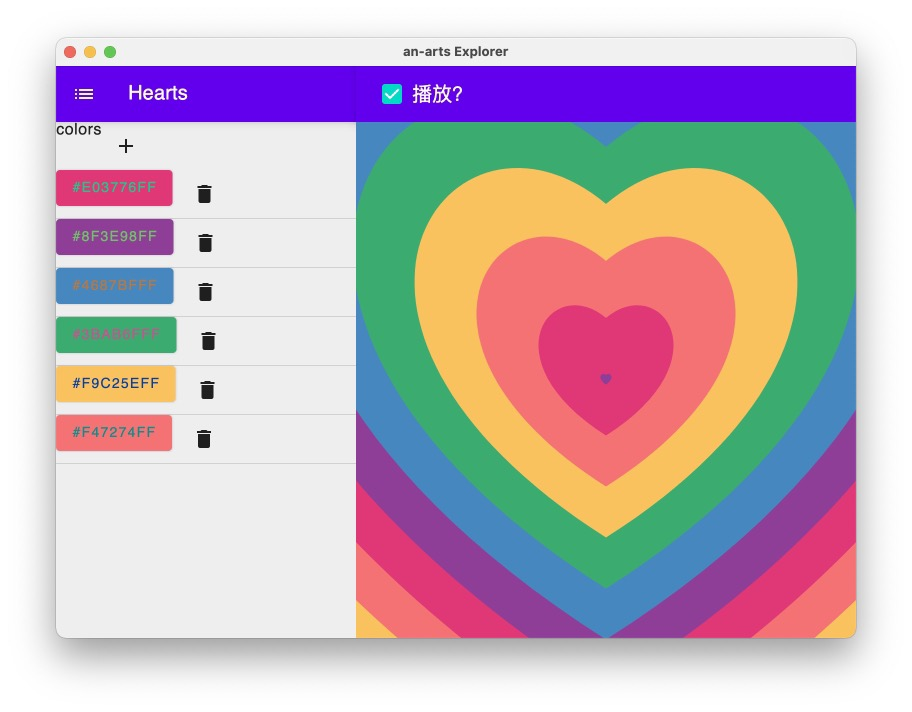
+ Identicon
  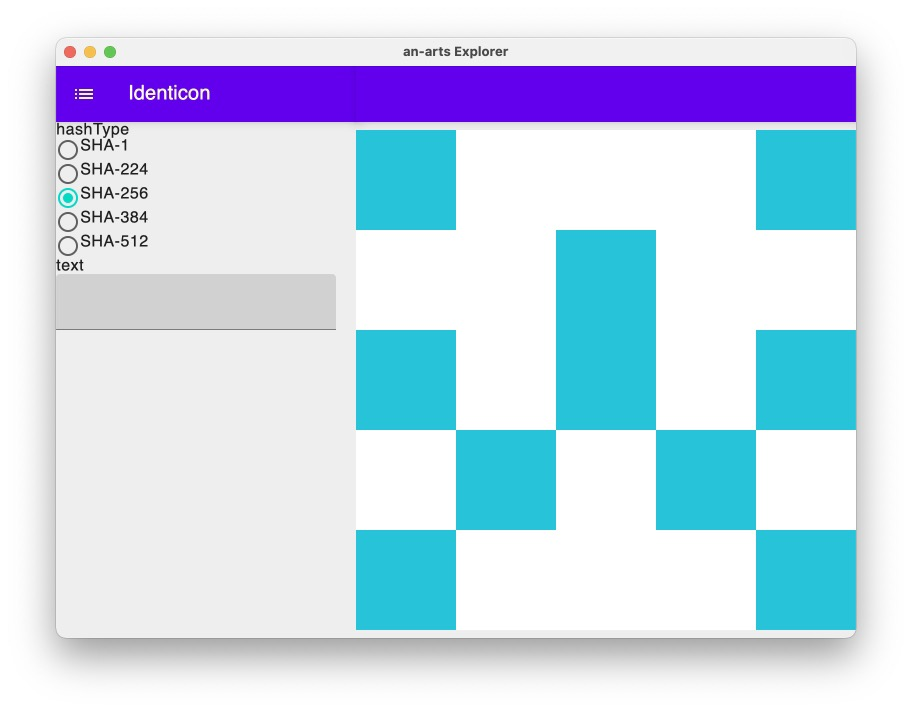
+ DotsWave
  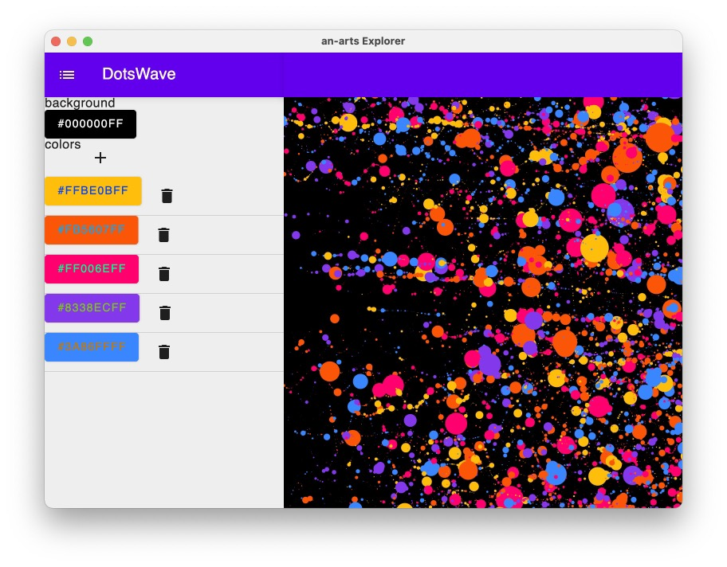
+ CistercianNumerals
  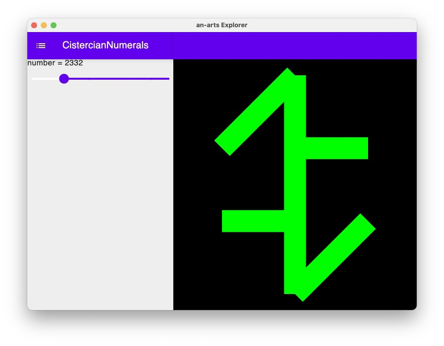
+ 💫 CistercianClock
  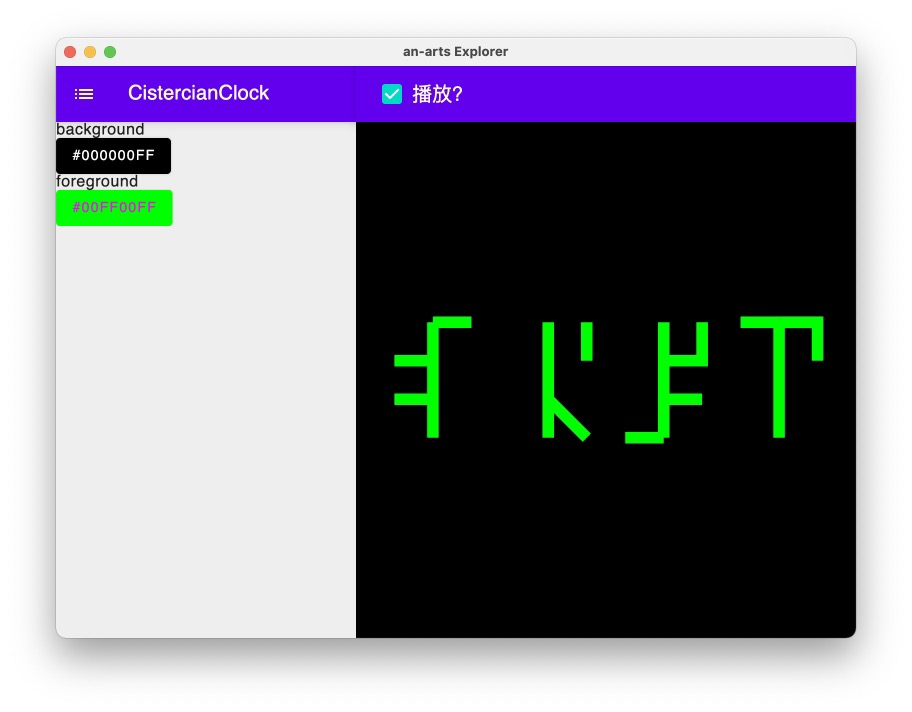
+ 💫 VoidSetup
  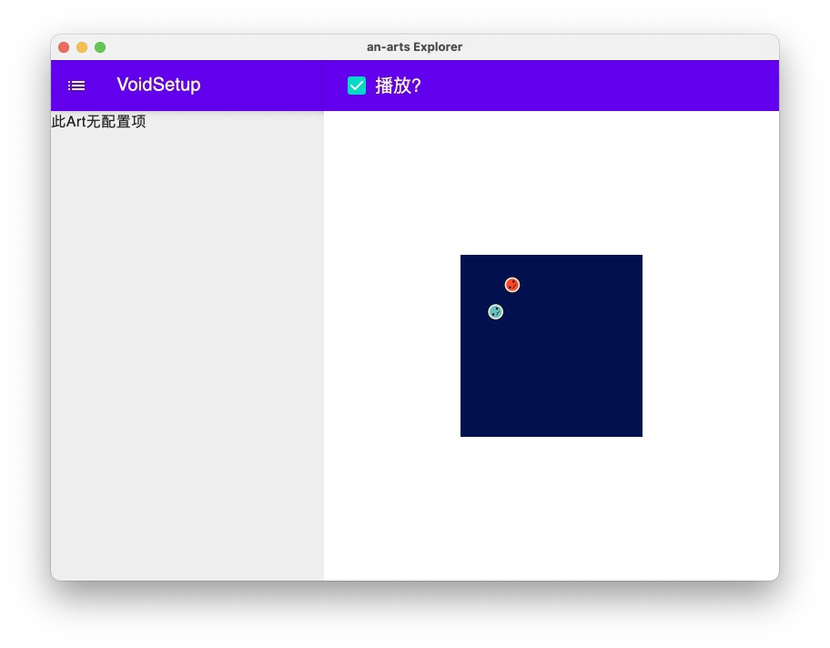
+ RecursiveTree
  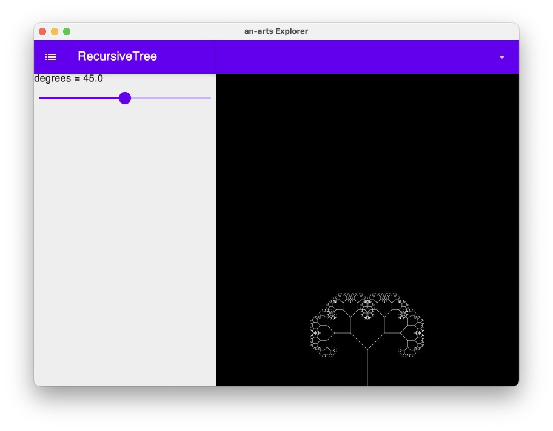
+ SilkSky
  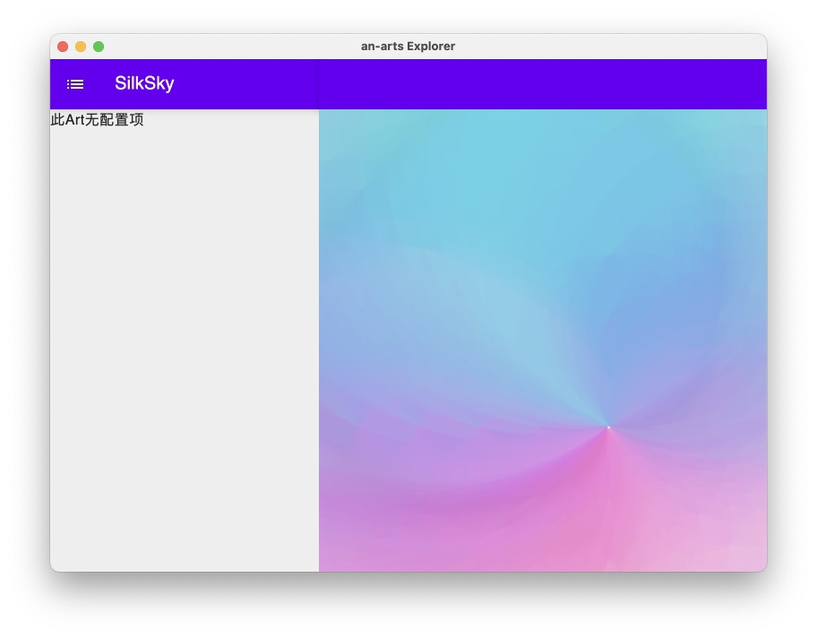

## 特别感谢

感谢以下网站、仓库或链接提供的灵感。

+ https://github.com/jdxyw/generativeart
    + CircleLoop
    + Maze
    + Yarn
    + DotsWave
    + SilkSky

+ https://github.com/Akashkamble/CanvasPlayground
    + 💫 RotatingSquares
    + 💫 CircleAndDotGrid
    + 💫 CircleGridScale

+ https://codepen.io/giaco/pen/BbpKZy
    + 💫 Hearts

+ https://github.com/stewartlord/identicon.js
    + Identicon

+ https://github.com/ednl/cistercian-clock/blob/main/sketch.js
    + CistercianNumerals
    + 💫 CistercianClock

+ https://sumygg.com/2018/07/31/p5js-version-for-taiko-drum-master-song-void-setup/
    + 💫 VoidSetup

+ https://p5js.org/examples/simulate-recursive-tree.html
    + RecursiveTree

## 贡献

一个人的想法、灵感和精力毕竟是有限的。如果有任何想法，欢迎提供PR、Issue。

## 许可

MIT
